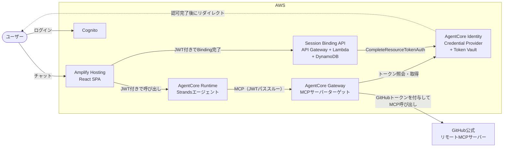

# GitHub Agent — AgentCore Gateway 3LO フルサーバーレスサンプル

Amazon Bedrock AgentCore Gateway のアウトバウンド認証（ユーザー委任型認可 / 3LO）で GitHub 公式リモート MCP サーバーに接続する、フルサーバーレスのチャットエージェントです。

- ユーザーは Cognito でログインし、チャットで自分の GitHub アカウントの情報（リポジトリ・Issue・PR・コミットなど）を質問できます
- 初回のツール呼び出し時にチャット内へ GitHub の認可リンクが表示され、認可を完了するとエージェントが自動で処理を再開します
- GitHub のアクセストークンは Gateway と Token Vault の間で完結し、エージェントのコード・Runtime のコンテナ・フロントエンドのいずれにも現れません
- インフラは Amplify Gen 2 の backend.ts に集約されており、シークレット登録を済ませておけばデプロイ 1 回で全リソースが立ち上がります

## アーキテクチャ



| コンポーネント | 使用サービス | 役割 |
|---------------|-------------|------|
| フロントエンド | Amplify Hosting（React SPA） | チャット UI と OAuth コールバック画面 |
| ユーザー認証 | Amazon Cognito（Amplify Auth） | アプリへのログイン。アクセストークンを Runtime・Gateway の呼び出しにも利用 |
| エージェント | AgentCore Runtime + Strands Agents | Gateway の MCP ツールを呼び出すエージェント |
| ツール基盤 | AgentCore Gateway | GitHub 公式リモート MCP サーバーを中継し、アウトバウンド認証（3LO）でトークンを付与 |
| 認可基盤 | AgentCore Identity | GitHub 用 Credential Provider と Token Vault |
| Session Binding API | API Gateway + Lambda + DynamoDB | 認可フローの記録と Session Binding の完了 |

3LO フローの詳細（シーケンス図・設計判断の理由）は [docs/architecture.md](docs/architecture.md) を参照してください。

## ディレクトリ構成

```
.
├── amplify/                        # Amplify Gen 2 バックエンド定義
│   ├── backend.ts                  # 全リソースの組み立て（Gateway / Runtime / Identity 含む）
│   ├── auth/resource.ts            # Cognito（Amplify Auth）
│   ├── functions/session-binding/  # Session Binding 用 Lambda
│   └── github-mcp-tools.json       # Gateway ターゲットに渡す静的ツールスキーマ（厳選6ツール）
├── agent/                          # Strands エージェント（詳細は agent/README.md）
│   ├── main.py                     # エントリーポイント（MCPClient で Gateway に接続）
│   ├── gateway_auth.py             # 3LO 認可待ちを扱う strands フック
│   └── Dockerfile                  # ARM64 イメージ（CDK がアセットとしてビルド）
├── src/                            # React SPA
│   ├── App.tsx                     # チャット UI（SSE ストリーミング / ツール表示 / 認可カード）
│   └── Callback.tsx                # OAuth コールバック画面（Session Binding 完了）
├── docs/                           # 設計解説・トラブルシューティング
└── amplify.yml                     # Amplify Hosting のビルド設定（Docker ビルド対応）
```

## 前提

| 項目 | 値 |
|------|-----|
| リージョン | us-east-1（AgentCore が使えるリージョンなら変更可。コードはリージョン非依存） |
| Python | 3.12 |
| Node.js | 22.x |
| パッケージ管理 | uv（Python） / pnpm（Node.js） |
| エージェント | Strands Agents + MCP Python SDK |
| モデル | Claude Sonnet 4.5（`us.anthropic.claude-sonnet-4-5-20250929-v1:0`） |
| IaC | aws-cdk-lib 2.255.0 以降（aws_bedrockagentcore モジュールを使用） |
| コンテナ | Docker（ローカル開発時は Docker Desktop 起動が必要） |

事前に必要なもの:

- GitHub アカウント
- Amazon Bedrock で Claude モデルが有効化済みであること
- （Hosting へデプロイする場合）Amplify Hosting に接続する GitHub リポジトリ

## セットアップ

### 1. GitHub OAuth App の作成

1. GitHub の Settings → Developer settings → OAuth Apps から「New OAuth App」を押下
2. Application name は任意、Homepage URL は任意、Authorization callback URL は仮の URL で作成（手順 5 で差し替えます）
3. Client ID を控え、「Generate a new client secret」で Client Secret を控える（生成直後しか表示されません）

`amplify/backend.ts` の `GITHUB_CLIENT_ID` を、控えた Client ID に書き換えてください。

### 2. クライアントシークレットを Secrets Manager に登録

```shell
aws secretsmanager create-secret \
  --name github-agent/oauth-client-secret \
  --secret-string '{"client_secret": "<GitHubのClient Secret>"}' \
  --region us-east-1
```

> [!WARNING]
> 必ず JSON 形式で登録してください。プレーン文字列だと CloudFormation の事前検証で `Required property [JsonKey] not found` になりデプロイが失敗します（EXTERNAL 参照は SecretId と JsonKey の両方が必須のため）。

### 3. sandbox で動かす（ローカル開発）

sandbox でも Gateway・Runtime を含む全リソースが作成されます。リソース名には環境ごとの接尾辞（sandbox は OS ユーザー名、Hosting はブランチ名）が付き、コールバック先は `http://localhost:5173/callback` に向きます。

```shell
# Docker Desktop を起動しておく（エージェントイメージをローカルでビルドするため）
pnpm install
pnpm ampx sandbox        # バックエンドのデプロイ（変更監視つき）
pnpm dev                 # 別ターミナルで。http://localhost:5173
```

> [!NOTE]
> `ampx sandbox` の監視対象は amplify/ 配下のみです。agent/ のコードだけ変更した場合は `touch amplify/backend.ts` で再デプロイをトリガーしてください。

### 4. Amplify Hosting へのデプロイ

1. リポジトリを push し、Amplify コンソールから Hosting に接続する（ビルド設定は `amplify.yml` を使用）
2. Amplify コンソールの「ビルドの設定」→「ビルドイメージ」を `public.ecr.aws/codebuild/amazonlinux-x86_64-standard:5.0` に変更する（標準イメージには Docker が無いため。amplify.yml 冒頭の 2 行がこのイメージ内で dockerd を起動し ARM64 ビルドを可能にします）
3. SPA のルーティング用に「書き換えて、リダイレクト」へ下記ルールを追加する（/callback への直接アクセス対応）

| 送信元アドレス | ターゲットアドレス | 入力 |
|--------------|------------------|------|
| `</^[^.]+$/>` | /index.html | 200（書き換え） |

### 5. GitHub OAuth App へのコールバック URL 登録

デプロイで作成された Credential Provider のコールバック URL を取得し、手順 1 の OAuth App の Authorization callback URL に設定します。Provider 名には環境の接尾辞が付きます（main ブランチなら `github-provider-main`、sandbox なら `github-provider-<OSユーザー名>`）。

```shell
aws bedrock-agentcore-control get-oauth2-credential-provider \
  --name github-provider-main --region us-east-1 \
  --query callbackUrl --output text
```

> [!NOTE]
> GitHub OAuth App に登録できるコールバック URL は 1 つだけです。sandbox と Hosting の両方で 3LO まで通す場合は、開発用の OAuth App をもう 1 つ作成して Client ID / シークレットを使い分けてください。

## 動作確認

1. アプリにアクセスし、Cognito でサインアップ・ログインする
2. 「私のリポジトリを教えて」などと送信すると、初回は GitHub の認可リンクが表示される（エージェントは裏で 5 秒間隔のリトライで認可完了を待機）
3. リンクから GitHub の認可を完了すると、コールバック画面に「GitHub連携が完了しました」と表示され、元のチャットで回答が自動で流れ始める
4. 2 回目以降の質問は認可なしで即座に回答が返る（Token Vault にトークンが保管済みのため）

うまく動かない場合は [docs/troubleshooting.md](docs/troubleshooting.md) を参照してください。

## 運用メモ

- エージェントの更新: コードを修正して push するだけです。CDK アセットのハッシュが変わるため、新しいイメージが自動でビルド・デプロイされます（sandbox は `touch amplify/backend.ts`）
- 公開ツールの変更: `amplify/github-mcp-tools.json` を編集して再デプロイします。GitHub MCP サーバーの実スキーマから再生成する場合は `scripts/fetch_mcp_tools.py` の PICK を編集して下記を実行します（トークンは読み取りだけなので gh CLI のもので構いません）

  ```shell
  GITHUB_TOKEN=$(gh auth token) uv run --with mcp python scripts/fetch_mcp_tools.py
  ```
- GitHub トークンの有効期限: OAuth App のトークンはデフォルトで無期限です。不要になったら Credential Provider やトークンの削除を忘れないでください

## リソースの削除

- Amplify アプリを削除（Hosting・Cognito・Session Binding API に加え、CDK 管理の Gateway・ターゲット・Credential Provider・Runtime もまとめて削除されます）
- sandbox は `pnpm ampx sandbox delete`
- Secrets Manager のシークレット（github-agent/oauth-client-secret）
- GitHub OAuth App

## ドキュメント

| ドキュメント | 内容 |
|-------------|------|
| [docs/architecture.md](docs/architecture.md) | 3LO フローの詳細、設計判断の理由（JWT パススルー / 静的ツールスキーマ / Session Binding 方式） |
| [docs/troubleshooting.md](docs/troubleshooting.md) | 実際に踏んだエラーと対処（デプロイ・実行時・開発時） |
| [agent/README.md](agent/README.md) | エージェントの構成と SSE イベント仕様 |
