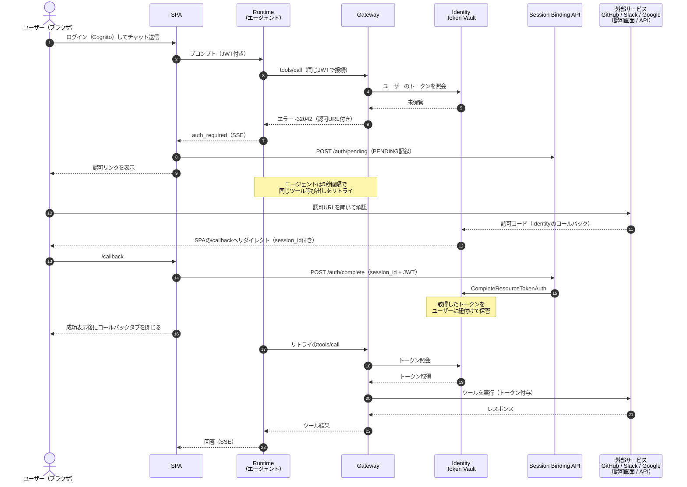
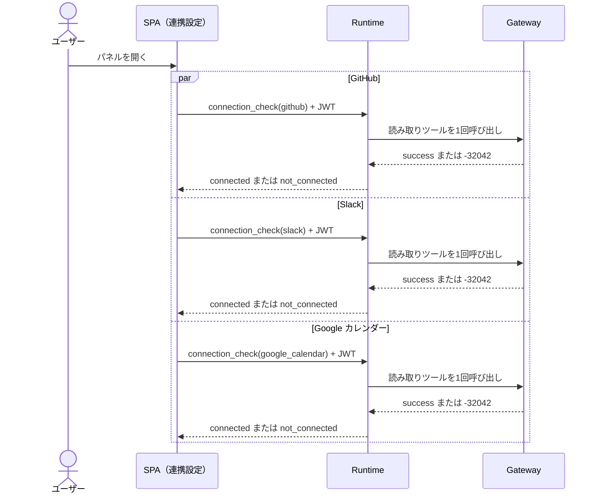
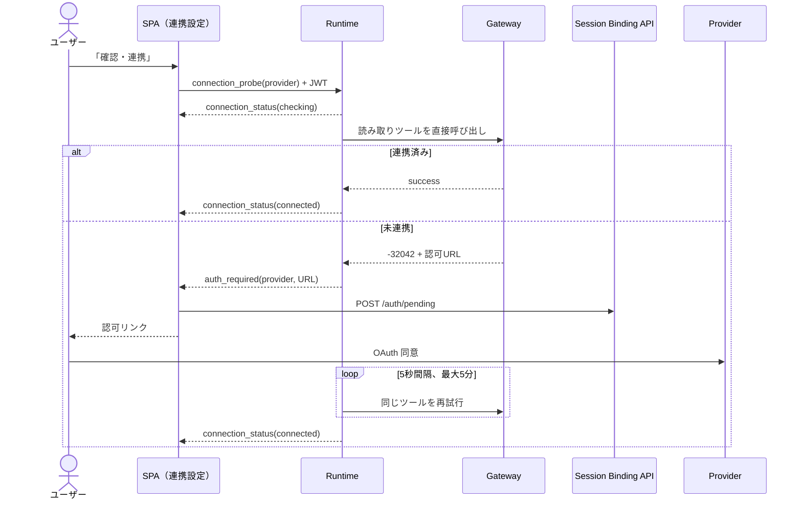
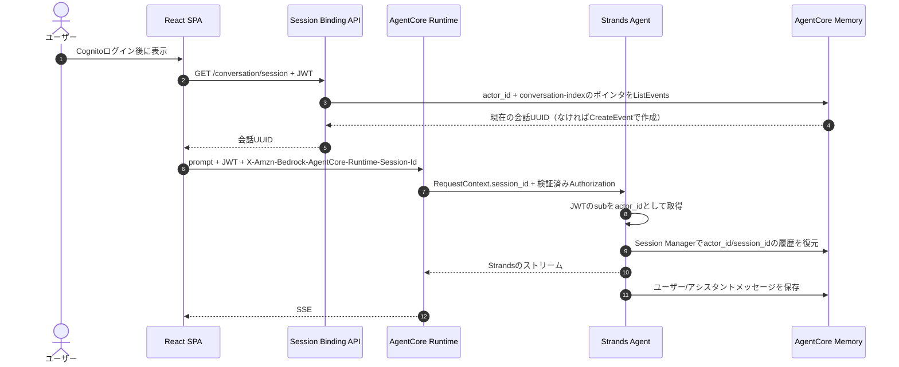

# アーキテクチャ解説

このドキュメントでは、3LO（ユーザー委任型認可）フローの詳細と、この構成に至った設計判断をまとめます。全体像と手順は [README](../README.md) を参照してください。

## 3LO フローの全体像

処理の流れをシーケンス図にすると下記のとおりです。初回のツール呼び出しが認可 URL の返却（URL elicitation）になり、ユーザーの認可と Session Binding を挟んで、リトライで処理が再開されるのがポイントです。



### 接続状態の自動確認（connection_check）

連携設定パネルを初めて開くと、SPA は GitHub・Slack・Google カレンダーの `connection_check` を並列で実行します。Runtime は LLM / Memory を起動せず、各サービスの読み取りツールを 1 回だけ呼びます。未連携時の elicitation は認可 URL を返さず `not_connected` へ変換するため、パネルを開いただけでは OAuth や Session Binding を開始しません。1 サービスの失敗も、ほかの確認を止めません。

確定した `connected` / `not_connected` と確認時刻だけを、Cognito のユーザー ID で分離した `sessionStorage` へ 5 分間保存します。再読み込み直後は `前回: 連携済み` のように表示し、パネルを開くと前回値を残したまま並列で再確認します。トークン、認可 URL、エラー本文、provider のレスポンスは保存しません。



### 事前連携（connection_probe）

`not_connected` のサービスで「連携する」を押すと、個別の `connection_probe` を開始します。Runtime は LLM / Memory を起動せず、Gateway の読み取りツールを直接呼び出します。



チャット起点の認可フローも引き続き利用でき、`auth_required` に明示的な `provider` が付きます。接続状態はパネルと共有されます。

`connection_check` は provider ごとに独立しているため、自動確認だけでなく手動の「再確認」も別サービスなら並列実行できます。`connection_probe` は Session Binding の PENDING レコードがユーザーごとに 1 件であるため、認可だけは同時に 1 サービスへ制限します。並列認可へ変更する際の条件は [connection-settings-constraints.md](connection-settings-constraints.md) にまとめています。

OAuth 完了後の `/callback` は成功を短く表示してから `window.close()` を呼びます。ブラウザの制限で自動クローズできない場合は、完了状態を維持したまま手動の「このタブを閉じる」を表示します。

## 設計判断

### JWT パススルー（この構成の肝）

同一の Cognito アクセストークンを SPA → Runtime → Gateway と引き渡します。

- SPA は `fetchAuthSession()` で取得したアクセストークンを付けて Runtime を直接呼び出す
- Runtime は `RequestHeaderConfiguration.RequestHeaderAllowlist: ['Authorization']` により Authorization ヘッダーをエージェントへ転送する（エージェントは `context.request_headers` から取得）
- エージェントは同じ JWT を付けて Gateway に MCP で接続する。Gateway 側は CUSTOM_JWT オーソライザー（Cognito の Discovery URL + クライアント ID）で検証する

Token Vault のユーザー識別は Gateway のインバウンド JWT をもとに行われます。ここでエージェント自身の M2M トークンを使ってしまうと、全ユーザーのトークンが 1 つの ID に紐付き、ユーザー委任の意味がなくなります。ユーザーの JWT をそのまま渡すことが必須です。

この結果、各サービスのトークンの取得・保管・付与はすべて Gateway と Token Vault の間で完結し、エージェントのコードにも Runtime のコンテナにもフロントエンドにもトークンが現れません。

### URL elicitation（未認可時のエラー形式）

Token Vault に該当ユーザーのトークンが無い場合、Gateway は tools/call に対して JSON-RPC エラー -32042 を返します。実測した形式は下記のとおりです。

```json
{
  "code": -32042,
  "message": "This request requires more information.",
  "data": {
    "elicitations": [
      {
        "mode": "url",
        "elicitationId": "xxxxxxxx-xxxx-xxxx-xxxx-xxxxxxxxxxxx",
        "url": "https://bedrock-agentcore.us-east-1.amazonaws.com/identities/oauth2/authorize?request_uri=urn%3Aietf%3Aparams%3Aoauth%3Arequest_uri%3A...",
        "message": "Please login to this URL for authorization."
      }
    ]
  }
}
```

- 認可 URL（request_uri）の有効期限は 10 分
- リトライごとに新しい elicitation（新しい request_uri）が発行される。フロントへの通知は初回のみなので実害はない
- 認可完了後のリダイレクトは `/callback?session_id=urn:ietf:params:oauth:request_uri:...` の形式で届く（session_id の値は認可 URL の request_uri と同じ URN）

### エージェントは標準の MCP 接続と認可フックだけ

エージェント（[agent/](../agent/)）は Strands の標準的な MCP 統合そのままです。Gateway について知っているのは接続先 URL と認証ヘッダーだけで、GitHub / Slack / Google 用のツール実装はありません。

```python
gateway = MCPClient(lambda: streamablehttp_client(
    GATEWAY_URL, headers={"Authorization": f"Bearer {bearer_token}"}
))
with gateway:
    agent = Agent(
        model=MODEL_ID,
        tools=gateway.list_tools_sync(),
        hooks=[GatewayAuthHook(event_queue)],
    )
```

3LO の認可待ちは横断的関心事として `gateway_auth.py` のフック 1 つに分離しています。これを支えているのが strands-agents（1.45.0 で確認）の 2 つの組み込み動作です。

1. MCPClient は -32042 の elicitation エラーを組み込みで解釈し、`MCP Elicitation required: ... with data [...]` 形式のテキストを持つエラー結果に変換する。自前で McpError を捕まえる必要がない
2. AfterToolCallEvent フックには書き込み可能な retry フラグがあり、「結果を破棄して同じツールを再実行」を公式にサポートしている。ツール実行フックは非同期コールバックに対応しているため、`asyncio.sleep` でポーリング間隔を空けてもイベントループを塞がない

フックがやることは 3 つだけです: ツール結果が認可要求エラーか判定 → 認可 URL を一度だけフロントエンドへ通知 → 5 秒待って `event.retry = True`（5 分でタイムアウトし、エラー結果をモデルへ返す）。フックはプロバイダー非依存なので、ターゲットやツールが増えてもフックは 1 つのままです（Slack ターゲット追加時も変更不要でした）。

### 静的ツールスキーマ（mcpToolSchema）

MCP サーバーターゲットは GitHub 公式リモート MCP サーバー（`https://api.githubcopilot.com/mcp/`）と Slack 公式リモート MCP サーバー（`https://mcp.slack.com/mcp`）の 2 つです。ここに 1 つ考慮点があります。3LO の MCP サーバーターゲットは、Gateway が作成時にツール一覧を同期しに行く際、管理者の対話的な認可が必要になります（ターゲットが CREATE_PENDING_AUTH 状態で止まる）。これでは IaC のワンショットデプロイが崩れます。

そこで mcpToolSchema でツール定義を静的に渡す方式（認可コードグラント専用の仕組み）を使っています。GitHub MCP サーバーは 44 ツールを公開していますが、読み取り系の 6 つ（get_me / search_repositories / list_commits / list_pull_requests / search_code / search_issues）に厳選しました（`amplify/github-mcp-tools.json`）。Slack MCP サーバーは 7 ツールのうち 5 つ（slack_search_channels / slack_search_public / slack_read_channel / slack_read_thread / slack_send_message）を採用しています（`amplify/slack-mcp-tools.json`）。

スキーマの書式には 2 つ癖があります。InlinePayload に渡す JSON は配列ではなく `{"tools": [...]}` 形式のオブジェクトであること（配列を直接渡すと Invalid MCP ToolSchema でデプロイが失敗します）。そして inputSchema に使えるキーは type / properties / required / items / description のみで、実サーバーのレスポンスに含まれる enum や default 等は取り除く必要があります。

静的スキーマには副次的なメリットもあります。公開するツールを明示的に管理下に置けるうえ、Gateway による同期自体を行わないため、MCP サーバー側の同期系メソッドの実装状況にも影響されません。実際、Slack MCP サーバーは `resources/list` / `resources/templates/list` を実装しておらず同期ベースのターゲットでは READY になりませんが、静的スキーマならこの問題自体が発生しません。ツール定義の再生成には取得スクリプト（[scripts/fetch_mcp_tools.py](../scripts/fetch_mcp_tools.py)）が使えます。

### Slack ターゲットの認可設計（CustomOauth2）

Slack MCP サーバーはユーザートークン（`xoxp-`）でしか呼び出せません。ここに落とし穴があります。AgentCore Identity のビルトイン `SlackOauth2` ベンダーは標準の認可エンドポイント + `oauth.v2.access` を使いますが、このトークンレスポンスはトップレベルにボットトークンを返す形式（ユーザートークンは `authed_user` 内）のため、Token Vault にはボットトークンが保存されます。認可フローは正常に完了するのに、ツール呼び出しだけが Slack 側の Authorization error で拒否されるという分かりにくい失敗になります（実測で確認）。

そこで `CustomOauth2` ベンダーで、Slack が MCP 向けに用意しているユーザーフロー専用エンドポイントを明示しています。

- AuthorizationEndpoint: `https://slack.com/oauth/v2_user/authorize`
- TokenEndpoint: `https://slack.com/api/oauth.v2.user.access`（標準 OAuth 形式でユーザートークンを返す）

Slack App 側にも 3 つの前提設定が必要です。User Token Scopes の設定、MCP サーバーアクセスの有効化、ボットユーザーの作成（無いと認可画面でエラーになります）です。詳細は README のセットアップ手順を参照してください。PKCE は有効化しません（コンフィデンシャルクライアントのため不要で、有効化は不可逆操作です）。

### Google カレンダーターゲットの設計（OpenAPI ターゲット）

Google には公式の Workspace MCP サーバー（Developer Preview）がありますが、ツール実行に Workspace 管理者の承認が必要なため、このサンプルでは Gateway の OpenAPI ターゲット（REST API をそのまま MCP ツール化する機能）で Calendar API に接続しています。OpenAPI ターゲットも MCP サーバーターゲットと同じ 3LO（Authorization Code）に対応しており、認可フロー・Token Vault の使われ方・エージェント側の見え方はまったく同じです。エージェントから見れば `googlecal___listEvents` のような MCP ツールが 1 つ増えるだけです。

OpenAPI 定義（`amplify/google-calendar-openapi.json`）は Calendar API の Discovery ドキュメントから自動変換したものではなく、使う読み取り系 3 操作（calendarList.list / events.list / events.get）だけを手書きしたものです。`operationId` がそのままツール名になり、description がモデルのツール選択精度に直結するため、静的ツールスキーマと同じ「厳選」方針を採っています。スキーマは self-contained である必要があり、`$ref` は使えません。

認可設計はビルトインの `GoogleOauth2` ベンダーそのままです。Google のトークンレスポンスは標準準拠（トップレベルに `access_token`）なので、Slack で踏んだボットトークン問題は起きません。ただし Google のアクセストークンは 1 時間で失効するため、ターゲットの OAuth 設定に `CustomParameters: { access_type: 'offline', prompt: 'consent' }` を指定してリフレッシュトークンの発行を認可 URL に要求しています。

### Session Binding（Lambda + DynamoDB 方式)

認可完了時、コールバックに届いた session_id を「その認可フローを開始した本人」の操作として CompleteResourceTokenAuth に渡す必要があります。これをサーバーサイドで検証するのが Session Binding API です。

- `POST /auth/pending` — 認可リンク表示の直前に、ユーザー ID（JWT の sub）をキーに PENDING レコードを書き込む（TTL 15 分）
- `POST /auth/complete` — コールバック画面から session_id を受け取り、ConditionExpression で PENDING → COMPLETED へワンタイム遷移させたうえで CompleteResourceTokenAuth を呼ぶ。API 呼び出しが失敗した場合は PENDING へロールバックして再試行可能にする

この DynamoDB テーブルが守っているものは 3 つあります。自分が開始した認可フローの PENDING レコードが無い限り session_id を知っていても Binding を完了できないこと、PENDING → COMPLETED は一度しか遷移できないため同じフローを使い回せないこと、そして放置されたフローは TTL で 15 分後に自動失効することです。

HttpOnly Cookie で解決する方式（SSR 環境が必要）と比べると実装量は増えますが、静的 SPA のままで済み、認可フローの状態がテーブルに残るため監査もしやすくなります。

### IAM の要点（実測で判明したもの）

- Gateway ロールには `bedrock-agentcore:GetWorkloadAccessToken` だけでは足りません。ユーザー JWT を渡すアウトバウンド認証では `GetWorkloadAccessTokenForJWT` が必要です（`GetWorkloadAccessTokenForUserId` も合わせて付与）
- Session Binding の Lambda にも EXTERNAL シークレットの `secretsmanager:GetSecretValue` が必要です。CompleteResourceTokenAuth の内部で Identity が呼び出し元の権限でクライアントシークレットを取得するためです

### デプロイのワンショット化

CloudFormation の AWS::BedrockAgentCore:: 系リソースタイプと aws-cdk-lib の L2 コンストラクトにより、Cognito・Session Binding API・Credential Provider・Gateway・ターゲット・Runtime のすべてを `amplify/backend.ts` に集約しています。

- Runtime は L2（`agentcore.Runtime` + `AgentRuntimeArtifact.fromAsset`）。エージェントのコンテナイメージは CDK がアセットとして自動でビルド・push する。実行ロールの自動作成も L2 の恩恵
- Gateway / ターゲット / Credential Provider は L1（CfnResource 直書き）。3LO 系の新しいプロパティに対する L2 の追随リスクを避けるため
- 値の受け渡しはすべて CDK 内で解決される。Gateway URL は Runtime の環境変数として CloudFormation 参照で渡り、エージェント ARN は amplify_outputs.json 経由でフロントエンドのビルドに届く

## AgentCore Memory（短期記憶）

会話の継続には、AgentCore RuntimeのHTTPセッションとAgentCore Memoryの短期イベントを同じ会話UUIDで束ねます。現在の会話UUID自体もAgentCore Memoryの専用`conversation-index`セッションへ保存するため、ブラウザのlocalStorageや会話用DynamoDBは使いません。



Memoryは`memoryStrategies`を設定しないため短期記憶のみです。イベントの保持期間は90日で、`AgentCoreMemorySessionManager`がAgent初期化時に履歴を読み、各メッセージを保存します。`batch_size=1`で即時保存し、非同期Runtimeでは`async_mode=True`を使います。Agent初期化時の同期的な履歴読み込みは`asyncio.to_thread()`でワーカースレッドへ移します。

分離キーは次のとおりです。

- Browser: 会話UUIDを永続化しない。Session Binding APIから取得したUUIDはReactの実行中状態としてのみ保持する
- Memoryの会話インデックス: `actorId=Cognito JWT sub`、`sessionId=conversation-index`のblobイベントへ現在の会話UUIDを保存
- Runtime: `X-Amzn-Bedrock-AgentCore-Runtime-Session-Id`で会話UUIDを渡す
- Memoryの会話履歴: Cognito JWTの検証済み`sub`を`actorId`、会話UUIDを`sessionId`としてイベントを保存

actor_idはpayloadから受け取らず、Runtime authorizerで検証済みのAuthorizationヘッダーからのみ導出します。JWTの再署名検証はRuntimeの責務であり、エージェントは検証済みJWTのpayloadをデコードして`sub`を取り出します。Memory設定不備、IAM拒否、履歴復元・保存APIの失敗は、記憶があるように見せるステートレスフォールバックをせずSSE `error`イベントとして返します。

「新しい会話」はSPAがSession Binding APIへ`POST /conversation/session`を送り、AgentCore Memoryの`conversation-index`ポインタを新しいUUIDへ更新する操作です。旧イベントは即時削除せず、90日TTLで失効します。過去会話の一覧表示は提供しません。

Runtimeセッションと3LO認可用Session Binding APIの`session_id`は名前が似ていますが別物です。Runtimeセッションは会話の実行環境と短期Memoryの識別に使い、Session Bindingの値はOAuth認可リクエストを開始したユーザーへ一度だけ紐付けるために使います。

### Memory IAM

Runtime実行ロールとSession Binding API Lambdaには、それぞれ次の短期Memory grantを付与します。

- `memory.grantWrite(...)` — `bedrock-agentcore:CreateEvent`
- `memory.grantReadShortTermMemory(...)` — `GetEvent` / `ListEvents` / `ListActors` / `ListSessions`
- Runtimeの`memory.grantDeleteShortTermMemory(runtime)` — Session Managerのlegacy移行・メッセージ置換時の`DeleteEvent`

LambdaはCognito JWTの`sub`をactorIdとしてMemory APIへ渡し、現在ポインタイベントを90日保持します。LambdaにはDeleteEventや長期記憶の読み取り、Memory管理権限を付与していません。

## セキュリティ上の注意

- 現在のコールバック画面はアクセスすると自動で Binding を完了させる実装です。外部から不正な session_id を含むコールバック URL を踏まされるケースを考えると、完了前に確認ボタン（「この連携を承認しますか？」）を挟むとより安全です。本番運用ではこのひと手間の追加を推奨します
- Session Binding API の CORS は動作確認用に `*` を許可しています。本番では Amplify のドメインに絞ってください
- IAM ポリシーの Resource も一部 `*` です。本番では workload-identity / token-vault の ARN に絞ってください
- GitHub OAuth App のトークンはデフォルトで無期限です。一度 Token Vault に入ったトークンは長期間有効なままなので、不要になったら削除してください（Slack のユーザートークンや Google のリフレッシュトークンも同様）
