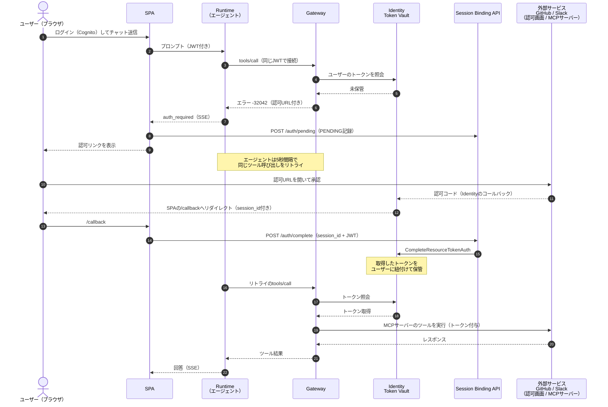

# アーキテクチャ解説

このドキュメントでは、3LO（ユーザー委任型認可）フローの詳細と、この構成に至った設計判断をまとめます。全体像と手順は [README](../README.md) を参照してください。

## 3LO フローの全体像

処理の流れをシーケンス図にすると下記のとおりです。初回のツール呼び出しが認可 URL の返却（URL elicitation）になり、ユーザーの認可と Session Binding を挟んで、リトライで処理が再開されるのがポイントです。



## 設計判断

### JWT パススルー（この構成の肝）

同一の Cognito アクセストークンを SPA → Runtime → Gateway と引き渡します。

- SPA は `fetchAuthSession()` で取得したアクセストークンを付けて Runtime を直接呼び出す
- Runtime は `RequestHeaderConfiguration.RequestHeaderAllowlist: ['Authorization']` により Authorization ヘッダーをエージェントへ転送する（エージェントは `context.request_headers` から取得）
- エージェントは同じ JWT を付けて Gateway に MCP で接続する。Gateway 側は CUSTOM_JWT オーソライザー（Cognito の Discovery URL + クライアント ID）で検証する

Token Vault のユーザー識別は Gateway のインバウンド JWT をもとに行われます。ここでエージェント自身の M2M トークンを使ってしまうと、全ユーザーのトークンが 1 つの ID に紐付き、ユーザー委任の意味がなくなります。ユーザーの JWT をそのまま渡すことが必須です。

この結果、各サービスのトークンの取得・保管・付与はすべて Gateway と Token Vault の間で完結し、エージェントのコードにも Runtime のコンテナにもフロントエンドにもトークンが現れません。

### URL elicitation（未認可時のエラー形式）

Token Vault に該当ユーザーのトークンが無い場合、Gateway は tools/call に対して JSON-RPC エラー -32042 を返します。実測した形式は下記のとおりです。

```json
{
  "code": -32042,
  "message": "This request requires more information.",
  "data": {
    "elicitations": [
      {
        "mode": "url",
        "elicitationId": "xxxxxxxx-xxxx-xxxx-xxxx-xxxxxxxxxxxx",
        "url": "https://bedrock-agentcore.us-east-1.amazonaws.com/identities/oauth2/authorize?request_uri=urn%3Aietf%3Aparams%3Aoauth%3Arequest_uri%3A...",
        "message": "Please login to this URL for authorization."
      }
    ]
  }
}
```

- 認可 URL（request_uri）の有効期限は 10 分
- リトライごとに新しい elicitation（新しい request_uri）が発行される。フロントへの通知は初回のみなので実害はない
- 認可完了後のリダイレクトは `/callback?session_id=urn:ietf:params:oauth:request_uri:...` の形式で届く（session_id の値は認可 URL の request_uri と同じ URN）

### エージェント設計: 標準の MCP 接続 + 認可フック

エージェント（[agent/](../agent/)）は Strands の標準的な MCP 統合そのままです。Gateway について知っているのは接続先 URL と認証ヘッダーだけで、GitHub / Slack 用のツール実装はありません。

```python
gateway = MCPClient(lambda: streamablehttp_client(
    GATEWAY_URL, headers={"Authorization": f"Bearer {bearer_token}"}
))
with gateway:
    agent = Agent(
        model=MODEL_ID,
        tools=gateway.list_tools_sync(),
        hooks=[GatewayAuthHook(event_queue)],
    )
```

3LO の認可待ちは横断的関心事として `gateway_auth.py` のフック 1 つに分離しています。これを支えているのが strands-agents（1.45.0 で確認）の 2 つの組み込み動作です。

1. MCPClient は -32042 の elicitation エラーを組み込みで解釈し、`MCP Elicitation required: ... with data [...]` 形式のテキストを持つエラー結果に変換する。自前で McpError を捕まえる必要がない
2. AfterToolCallEvent フックには書き込み可能な retry フラグがあり、「結果を破棄して同じツールを再実行」を公式にサポートしている。ツール実行フックは非同期コールバックに対応しているため、`asyncio.sleep` でポーリング間隔を空けてもイベントループを塞がない

フックがやることは 3 つだけです: ツール結果が認可要求エラーか判定 → 認可 URL を一度だけフロントエンドへ通知 → 5 秒待って `event.retry = True`（5 分でタイムアウトし、エラー結果をモデルへ返す）。フックはプロバイダー非依存なので、ターゲットやツールが増えてもフックは 1 つのままです（Slack ターゲット追加時も変更不要でした）。

### 静的ツールスキーマ（mcpToolSchema）

Gateway のターゲットは GitHub 公式リモート MCP サーバー（`https://api.githubcopilot.com/mcp/`）と Slack 公式リモート MCP サーバー（`https://mcp.slack.com/mcp`）の 2 つです。ここに 1 つ考慮点があります。3LO の MCP サーバーターゲットは、Gateway が作成時にツール一覧を同期しに行く際、管理者の対話的な認可が必要になります（ターゲットが CREATE_PENDING_AUTH 状態で止まる）。これでは IaC のワンショットデプロイが崩れます。

そこで mcpToolSchema でツール定義を静的に渡す方式（認可コードグラント専用の仕組み）を使っています。

- GitHub MCP サーバーは 44 ツールを公開しているが、読み取り系の 6 つ（get_me / search_repositories / list_commits / list_pull_requests / search_code / search_issues）に厳選している（`amplify/github-mcp-tools.json`）
- Slack MCP サーバーは 7 ツールのうち 5 つ（slack_search_channels / slack_search_public / slack_read_channel / slack_read_thread / slack_send_message）を採用している（`amplify/slack-mcp-tools.json`）
- InlinePayload に渡す JSON は配列ではなく `{"tools": [...]}` 形式のオブジェクト（配列直渡しは Invalid MCP ToolSchema でデプロイ失敗）
- inputSchema に使えるキーは type / properties / required / items / description のみ。実サーバーのレスポンスに含まれる enum や default 等は取り除く必要がある
- 副次的なメリットとして、公開するツールを明示的に管理下に置ける。Gateway による同期自体を行わないため、MCP サーバー側の同期系メソッドの実装状況にも影響されない（Slack MCP サーバーは `resources/list` / `resources/templates/list` を実装しておらず同期ベースのターゲットでは READY にならないが、静的スキーマならこの問題自体が発生しない）

ツール定義の再生成には取得スクリプト（[scripts/fetch_mcp_tools.py](../scripts/fetch_mcp_tools.py)）が使えます。

### Slack ターゲットの認可設計（CustomOauth2）

Slack MCP サーバーは**ユーザートークン（`xoxp-`）必須**です。ここに落とし穴があります。AgentCore Identity のビルトイン `SlackOauth2` ベンダーは標準の認可エンドポイント + `oauth.v2.access` を使いますが、このトークンレスポンスはトップレベルにボットトークンを返す形式（ユーザートークンは `authed_user` 内）のため、Token Vault にはボットトークンが保存されます。認可フローは正常に完了するのに、ツール呼び出しだけが Slack 側の Authorization error で拒否されるという分かりにくい失敗になります（実測で確認）。

そこで `CustomOauth2` ベンダーで、Slack が MCP 向けに用意しているユーザーフロー専用エンドポイントを明示しています。

- AuthorizationEndpoint: `https://slack.com/oauth/v2_user/authorize`
- TokenEndpoint: `https://slack.com/api/oauth.v2.user.access`（標準 OAuth 形式でユーザートークンを返す）

Slack App 側にも 3 つの前提設定が必要です（詳細は README のセットアップ手順を参照）: User Token Scopes の設定、MCP サーバーアクセスの有効化、ボットユーザーの作成（無いと認可画面でエラー）。PKCE は有効化しません（コンフィデンシャルクライアントのため不要、かつ不可逆操作）。

### Session Binding（Lambda + DynamoDB 方式)

認可完了時、コールバックに届いた session_id を「その認可フローを開始した本人」の操作として CompleteResourceTokenAuth に渡す必要があります。これをサーバーサイドで検証するのが Session Binding API です。

- `POST /auth/pending` — 認可リンク表示の直前に、ユーザー ID（JWT の sub）をキーに PENDING レコードを書き込む（TTL 15 分）
- `POST /auth/complete` — コールバック画面から session_id を受け取り、ConditionExpression で PENDING → COMPLETED へワンタイム遷移させたうえで CompleteResourceTokenAuth を呼ぶ。API 呼び出しが失敗した場合は PENDING へロールバックして再試行可能にする

DynamoDB が担う役割は 3 つです。

1. 事前登録のない完了要求の拒否: 自分が開始した認可フローの PENDING レコードが無い限り、session_id を知っていても Binding を完了できない
2. ワンタイム利用の強制: PENDING → COMPLETED は一度しか遷移できないため、同じフローの使い回しを防げる
3. 放置フローの自動失効: TTL により 15 分で無効になる

HttpOnly Cookie で解決する方式（SSR 環境が必要）と比べると実装量は増えますが、静的 SPA のままで済み、認可フローの状態がテーブルに残るため監査もしやすくなります。

### IAM の要点（実測で判明したもの）

- Gateway ロールには `bedrock-agentcore:GetWorkloadAccessToken` だけでは足りません。ユーザー JWT を渡すアウトバウンド認証では `GetWorkloadAccessTokenForJWT` が必要です（`GetWorkloadAccessTokenForUserId` も合わせて付与）
- Session Binding の Lambda にも EXTERNAL シークレットの `secretsmanager:GetSecretValue` が必要です。CompleteResourceTokenAuth の内部で Identity が呼び出し元の権限でクライアントシークレットを取得するためです

### デプロイのワンショット化

CloudFormation の AWS::BedrockAgentCore:: 系リソースタイプと aws-cdk-lib の L2 コンストラクトにより、Cognito・Session Binding API・Credential Provider・Gateway・ターゲット・Runtime のすべてを `amplify/backend.ts` に集約しています。

- Runtime は L2（`agentcore.Runtime` + `AgentRuntimeArtifact.fromAsset`）。エージェントのコンテナイメージは CDK がアセットとして自動でビルド・push する。実行ロールの自動作成も L2 の恩恵
- Gateway / ターゲット / Credential Provider は L1（CfnResource 直書き）。3LO 系の新しいプロパティに対する L2 の追随リスクを避けるため
- 値の受け渡しはすべて CDK 内で解決される。Gateway URL は Runtime の環境変数として CloudFormation 参照で渡り、エージェント ARN は amplify_outputs.json 経由でフロントエンドのビルドに届く

## セキュリティ上の注意

- 現在のコールバック画面はアクセスすると自動で Binding を完了させる実装です。外部から不正な session_id を含むコールバック URL を踏まされるケースを考えると、完了前に確認ボタン（「この連携を承認しますか？」）を挟むとより安全です。本番運用ではこのひと手間の追加を推奨します
- Session Binding API の CORS は動作確認用に `*` を許可しています。本番では Amplify のドメインに絞ってください
- IAM ポリシーの Resource も一部 `*` です。本番では workload-identity / token-vault の ARN に絞ってください
- GitHub OAuth App のトークンはデフォルトで無期限です。一度 Token Vault に入ったトークンは長期間有効なままなので、不要になったら削除してください（Slack のユーザートークンも同様）
