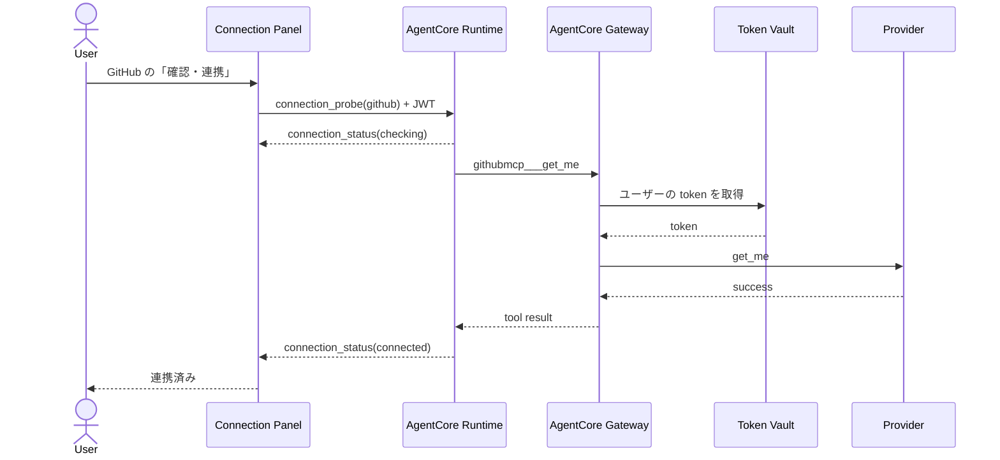
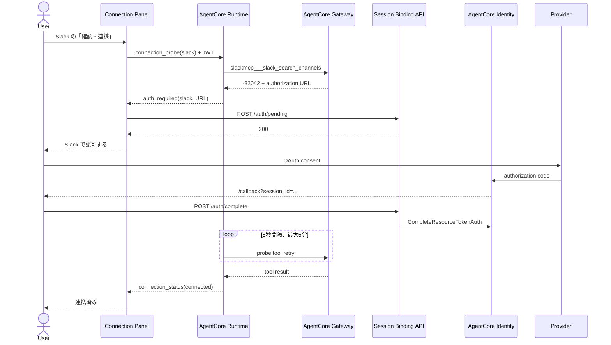

# 事前連携設定の設計・実装計画

## この文書について

この文書は、チャットで GitHub・Slack・Google カレンダーを初めて使う前に、ユーザーが任意のサービスを明示的に連携できる画面を追加するための設計書です。

実装者が背景を調べ直さなくても着手できるように、UX、フロントエンド構成、Runtime のイベント契約、AgentCore Gateway の呼び出し方、テスト、受け入れ条件までをまとめています。

- 作成ブランチ: `docs/connection-settings-design`
- 文書作成時点: 2026-07-24
- ステータス: 実装済み（2026-07-24）
- 対象サービス: GitHub、Slack、Google カレンダー
- 実機確認後の追加要望: [事前連携設定の実機確認フィードバック](connection-settings-feedback.md)

## 結論

チャット画面のヘッダーに「連携設定」を追加し、右側から開く軽量なパネルでサービスごとに「確認・連携」を実行できるようにします。

ボタンを押したときはチャットへ定型文を送らず、Runtime に接続確認専用のリクエストを送ります。Runtime は対象サービスの安全な読み取りツールを AgentCore Gateway 経由で直接 1 回呼び出します。

- Token Vault に有効なトークンがあれば `連携済み` にする
- 未連携なら既存の 3LO 認可 URL をパネル内に表示する
- 認可後は既存と同様にツール呼び出しを再試行し、成功したら `連携済み` にする
- 接続確認の結果やツールのレスポンスはチャット履歴へ追加しない
- 接続確認では LLM を呼ばず、会話 Memory も使用しない

AgentCore Identity には、ユーザーごとの接続状態だけを副作用なく一覧取得する API がありません。実装では認可を開始しない `connection_check` を別操作として用意し、パネルを開いた時点で 3 サービスを並列確認します。ユーザーが「連携する」を押した場合だけ、認可待機を伴う `connection_probe` を開始します。

参考:

- [OAuth 2.0 authorization URL session binding](https://docs.aws.amazon.com/bedrock-agentcore/latest/devguide/oauth2-authorization-url-session-binding.html)
- [GetResourceOauth2Token API](https://docs.aws.amazon.com/bedrock-agentcore/latest/APIReference/API_GetResourceOauth2Token.html)
- [Gateway の authorization code grant](https://docs.aws.amazon.com/bedrock-agentcore/latest/devguide/gateway-using-auth-ex-3lo.html)

## 目的

### 解決したいこと

現在は、ユーザーが「私のリポジトリを教えて」などのチャットを送信し、エージェントが対象ツールを選択して初めて認可リンクが表示されます。

この挙動には次の分かりにくさがあります。

- 認可が必要かどうかが、最初の質問を送るまで分からない
- 「質問すること」と「外部サービスを連携すること」が同じ操作に見える
- GitHub・Slack・Google カレンダーのうち、どれを連携したか把握しにくい
- デモや説明の前に必要なサービスだけ準備しておけない
- 認可リンクのプロバイダー名を URL 文字列から推測しており、AgentCore の認可 URL では正しく特定できない可能性がある

### 成功条件

- ユーザーがチャットを送らずに、任意の 1 サービスの連携を開始できる
- 接続確認や認可のための内部処理がチャット履歴へ混ざらない
- 既存の「チャット中に必要になったら認可する」導線も残る
- Token Vault や OAuth トークンをフロントエンドへ出さない
- 未連携、確認中、認可待ち、連携済み、失敗を文字でも判別できる
- キーボードとモバイルからも操作できる
- 同じユーザーによる複数の認可フローを同時に開始しない

## スコープ

### 今回実装する

- ヘッダーの「連携設定」ボタン
- デスクトップでは右側パネル、モバイルでは全画面になる連携設定 UI
- サービスごとの接続確認・連携開始
- 接続確認専用の Runtime リクエスト
- Gateway の読み取りツールを使った決定的な接続プローブ
- 接続状態を表す SSE イベント
- チャット起点の認可イベントへの明示的な `provider` 追加
- 共有 SSE クライアントへのフロントエンドの整理
- 接続状態のフロントエンド状態管理
- パネル初回表示時の並列自動確認
- 確定状態だけを保持するユーザー別・5 分間の `sessionStorage` キャッシュ
- 単体テスト、手動 OAuth 確認項目、README・関連文書の更新

### 今回実装しない

- OAuth トークンの削除、サービス側での認可取り消し
- `forceAuthentication=true` を使った強制再認可
- Token Vault の管理画面
- 複数サービスの同時認可
- 接続状態の `localStorage` 保存
- 接続状態専用 DynamoDB テーブル
- OAuth のスコープや Credential Provider の変更
- Cognito のログイン画面の再設計

「連携解除」は、アプリの表示だけを消しても実際の Token Vault や外部サービス側の認可が残るため、正しい失効手段を設計するまで表示しません。

## 現状の実装

### フロントエンド

`src/App.tsx` が次の責務をまとめて持っています。

- チャット入力
- Runtime 呼び出し
- SSE の読み取り
- ツール実行表示
- `auth_required` の処理
- 認可リンク表示

現在の Runtime payload は `{ "prompt": "..." }` だけです。

`auth_required` を受け取ると、フロントエンドは次の順序で動きます。

1. `POST /auth/pending` を呼ぶ
2. チャットメッセージとして認可案内を追加する
3. 認可リンクを新しいタブで開けるようにする

### Runtime / Agent

`agent/main.py` は全リクエストで次の処理を行います。

1. AgentCore Gateway へ接続する
2. Gateway の全ツールを Strands Agent へ渡す
3. LLM に prompt を処理させる
4. テキスト、ツール利用、エラーを SSE で返す

`agent/gateway_auth.py` の `GatewayAuthHook` は、ツール結果に含まれる 3LO の elicitation を検出し、最初の認可 URL を `auth_required` として返します。その後は 5 秒間隔、最大 5 分間、同じツール呼び出しを再試行します。

### Session Binding

`amplify/functions/session-binding/handler.ts` は次の 2 エンドポイントを持ちます。

- `POST /auth/pending`
- `POST /auth/complete`

DynamoDB のキーは `userId` だけなので、同じユーザーについて同時に保持できる PENDING フローは 1 件です。新しい UI でもこの前提を守り、1 サービスの確認・認可中は他サービスの開始操作を無効にします。

## 設計原則

### UX 原則

- チャットが主画面であり、連携設定は必要なときだけ開く副次画面とする
- 自動で認可画面を開かない
- パネルを開いただけでは外部サービスを呼ばない
- 「未連携」と断定できない状態は `未確認` と表示する
- 色だけで状態を表現しない
- 接続確認と認可をチャットの発言として扱わない
- 既存のチャット内認可を壊さず、設定パネルと状態を共有する

### 技術原則

- プロバイダー ID とツール名の対応は Runtime 側で固定し、ブラウザから任意のツール名を渡せないようにする
- 接続プローブは読み取り専用かつ小さいレスポンスになるツールに限定する
- 接続確認では Strands Agent と LLM を起動しない
- 接続確認では会話 Memory を作成・更新しない
- 認可 URL と OAuth トークンをログへ出さない
- Runtime の既存 `{ prompt }` payload は後方互換として受け付ける
- SSE の読み取りはチャンク境界を正しく扱う共通実装にする

## 検討した方式

### 定型チャットを裏で送る

不採用です。

実装量は小さいものの、モデルが必ず意図したツールを選ぶ保証がなく、LLM のコストと待ち時間が発生します。また、接続確認が会話履歴と Memory に残り、ユーザーが見ているチャットと内部状態が一致しなくなります。

### Runtime から AgentCore Identity API を直接呼ぶ

不採用です。

このアプリの通常の外部アクセスは Gateway が保持する workload identity とユーザー JWT の組み合わせで Token Vault を参照します。Runtime から別経路で Identity API を呼ぶと、Gateway と同じ認証コンテキストを再現する処理と Credential Provider ごとの設定を重複して持つことになります。

接続プローブも Gateway target を通す方が、実際のチャットと同じ token、scope、target、provider API まで確認できます。agent code が resource access token を直接受け取らないという現在の境界も維持できます。

### パネルを開いたときに全サービスを自動確認する

追加フィードバックを受けて採用しました。認可 URL を返さず 1 回で終了する `connection_check` を 3 サービス分並列実行します。認可 session と PENDING は生成せず、OAuth はユーザーが「連携する」を押したときだけ開始します。

### 最終確認状態をブラウザへ保存する

短時間キャッシュとして採用しました。`connected` / `not_connected` と確認時刻だけを、Cognito ユーザー ID で分離した `sessionStorage` へ 5 分間保存します。再読み込み直後は前回値であることを明示し、パネルを開くとバックグラウンドで再確認するため、古い表示を確定状態として扱い続けません。トークン、認可 URL、エラー本文、provider レスポンスは保存しません。

## フロントエンド設計

### ビジュアル方針

#### Visual thesis

既存の暗い開発者向けチャット画面を主役のまま保ち、連携設定は静かな補助面として重ねる。確認済みの状態だけをミント、ユーザー操作をアンバー、失敗を既存の danger 色で示す。

#### Content plan

1. ヘッダー: 「連携設定」への入口
2. パネル冒頭: この画面でできることを 1 文で説明
3. サービス一覧: 3 行の状態と主操作
4. 補足: トークンはこのブラウザへ保存されないことを短く説明

#### Interaction thesis

- パネルは短いスライドとフェードで開閉する
- 状態変更は行の高さを大きく変えず、ラベルと操作だけを切り替える
- 認可待ちになった行だけを展開し、認可ボタンを明確にする

`prefers-reduced-motion: reduce` ではスライドと状態遷移を無効にします。

### レイアウト

デスクトップでは、チャットの上に幅 420〜480px の右側パネルを重ねます。3 サービスを別々のカードにはせず、1 つの面の中に区切り線付きの行として並べます。

```text
┌──────────────────── 3LO Agent ─────────────────────────────┐
│                      [連携設定] [新しい会話] [ログアウト]  │
│                                                            │
│  チャット                                                   │
│                                     ┌──────────────────────┐│
│                                     │ 外部サービス連携   × ││
│                                     │ 使用するサービスを… ││
│                                     │                      ││
│                                     │ GitHub               ││
│                                     │ リポジトリとIssue     ││
│                                     │ 未確認 [確認・連携]  ││
│                                     │ ──────────────────── ││
│                                     │ Slack                ││
│                                     │ チャンネルと投稿      ││
│                                     │ 未確認 [確認・連携]  ││
│                                     │ ──────────────────── ││
│                                     │ Googleカレンダー      ││
│                                     │ カレンダーと予定      ││
│                                     │ 未確認 [確認・連携]  ││
│                                     │                      ││
│                                     │ トークンは…保存され… ││
│                                     └──────────────────────┘│
└────────────────────────────────────────────────────────────┘
```

モバイルでは同じ内容を全画面表示します。ヘッダーのラベルは「連携」「新規」「ログアウト」まで短縮し、ブランドを含めて 1 行に収めます。アイコンだけにはしません。

### 空状態からの導線

既存の提案ボタンの上か下に、強調しすぎないテキストボタンを追加します。

```text
先に外部サービスを連携する
```

ヘッダーと空状態は同じパネルを開きます。ログイン直後にパネルを自動表示することはしません。

### サービス行

各行は次の情報だけを持ちます。

- プロバイダー名
- 利用範囲の短い説明
- 状態ラベル
- 現在実行できる主操作

表示文言は次で固定します。

| Provider ID | 表示名 | 説明 |
|---|---|---|
| `github` | GitHub | リポジトリ、Issue、Pull Request |
| `slack` | Slack | チャンネル、投稿、スレッド |
| `google_calendar` | Google カレンダー | カレンダーと予定 |

### 状態

フロントエンドでは次の状態を持ちます。

| 状態 | 表示 | 操作 |
|---|---|---|
| `unknown` | 未確認 | 確認・連携 |
| `checking` | 確認中 | 操作不可、進行表示 |
| `authorization_required` | 認可が必要 | `<Provider> で認可する` |
| `connected` | 連携済み | 再確認 |
| `error` | 確認できませんでした | 再試行 |

状態遷移は次のとおりです。

```text
unknown ──確認・連携──> checking
checking ────────────> connected
checking ────────────> authorization_required
checking ────────────> error
authorization_required ──認可完了──> connected
authorization_required ──失敗/timeout──> error
connected ──再確認──> checking
error ──再試行──> checking
```

ページ再読み込み後は、有効期限内のキャッシュがあれば `前回: 連携済み` または `前回: 未連携` を表示します。パネルを開くと前回値を残したままスピナーを表示し、最新の確認結果へ置き換えます。有効期限切れ、別ユーザー、エラーになった provider のキャッシュは利用しません。

永続的な `localStorage` は使いません。`sessionStorage` と 5 分の TTL に限定し、再確認を必須にすることで、外部サービス側で認可が取り消された後の古い表示を抑えます。

### 認可待ち

未連携だった場合は該当する 1 行だけを展開します。

```text
GitHub
リポジトリ、Issue、Pull Request

認可が必要
GitHub の画面でアクセスを許可してください。

[GitHub で認可する]
```

- 認可リンクは既存と同じく新しいタブで開く
- `POST /auth/pending` が成功するまでリンクを表示しない
- URL は `https:` のみ許可する
- 認可後は元タブの Runtime リトライが成功し、状態を自動更新する
- パネルを閉じても接続処理の state と fetch は `App` 配下で保持する
- ページを閉じた場合でも、認可と callback が完了していれば Token Vault への保存自体は成立する

### 排他制御

次の期間は、他サービスの「確認・連携」とチャット送信を無効にします。

- `checking`
- `authorization_required`

理由は次の 2 点です。

1. 現在の Session Binding 用 DynamoDB レコードが `userId` ごとに 1 件である
2. 同じユーザーが複数の認可 URL を同時に扱うと、どのタブへ戻るべきか分かりにくい

パネルを開閉する操作と、既存メッセージの閲覧は可能なままにします。

### アクセシビリティ

- パネルはネイティブ `<dialog>` の `showModal()` を第一候補にする
- `aria-labelledby` で見出しを関連付ける
- 開いたときは閉じるボタンか最初の操作へフォーカスする
- Esc で閉じられる
- 閉じた後は「連携設定」ボタンへフォーカスを戻す
- 状態更新は `aria-live="polite"` で通知する
- 状態は色とテキストの両方で表す
- タップ領域は 44px 以上を確保する
- Provider アイコンは走査性を上げる目的だけで使い、`aria-hidden="true"` にする
- ローディング中は `aria-busy` と `disabled` を併用する

### モーション

- パネル表示: 160〜200ms の translateX と opacity
- backdrop: 160ms の opacity
- 状態更新: 120〜160ms の opacity
- ローディング: 既存のタイピング表現とは別の小さな progress 表示
- 大きなバウンス、装飾的なグラデーション、常時点滅は追加しない

## フロントエンドのコード構成

`App.tsx` へすべてを追加せず、Runtime 通信と接続状態を分離します。

```text
src/
├── App.tsx
├── Callback.tsx
├── components/
│   ├── ConnectionPanel.tsx
│   └── ProviderIcon.tsx
├── hooks/
│   └── useConnectionManager.ts
├── lib/
│   └── agentRuntime.ts
└── types/
    └── runtime.ts
```

### `lib/agentRuntime.ts`

責務:

- Runtime URL の組み立て
- Cognito access token を付けた fetch
- SSE の逐次デコード
- `AbortSignal` の処理
- HTTP エラーと不正イベントの正規化

現在の `App.tsx` は、各 `ReadableStream` chunk をそのまま改行で分割しています。JSON 行が chunk 境界で分割されると読み落とす可能性があるため、共通化時に carry buffer を持つ実装へ変更します。

想定インターフェース:

```ts
type InvokeRuntimeOptions = {
  payload: RuntimeRequest;
  runtimeSessionId: string;
  accessToken: string;
  signal?: AbortSignal;
  onEvent: (event: RuntimeEvent) => void;
};

async function invokeRuntime(options: InvokeRuntimeOptions): Promise<void>;
```

### `hooks/useConnectionManager.ts`

責務:

- 3 provider の状態
- 同時実行の抑止
- 接続確認専用 Runtime session ID の生成
- `auth_required` を受けた後の `/auth/pending`
- 接続確認用 AbortController
- チャット起点イベントと設定起点イベントの状態統合

接続確認用の Runtime session ID は `crypto.randomUUID()` で毎回作成し、会話用 session ID と分離します。

### `components/ConnectionPanel.tsx`

責務:

- dialog の開閉
- サービス行の表示
- 状態に応じた操作
- フォーカス管理
- モバイルレイアウト

Runtime fetch、Cognito token 取得、SSE parsing は持たせません。

### `types/runtime.ts`

Runtime request と SSE event を discriminated union として定義します。`App.tsx` と connection hook は同じ型を使います。

## Runtime API 設計

### Request

既存クライアントとの互換性を保つため、`operation` のない `{ prompt }` は chat として扱います。

```ts
type RuntimeRequest =
  | {
      operation?: 'chat';
      prompt: string;
    }
  | {
      operation: 'connection_probe';
      provider: 'github' | 'slack' | 'google_calendar';
    };
```

ブラウザから tool name や arguments は受け取りません。

### SSE events

既存 event は残し、接続状態と provider を追加します。

```ts
type RuntimeEvent =
  | { type: 'text'; data: string }
  | { type: 'tool_use'; tool_name: string }
  | {
      type: 'auth_required';
      provider: ProviderId;
      auth_url: string;
    }
  | {
      type: 'connection_status';
      provider: ProviderId;
      status: 'checking' | 'connected';
    }
  | {
      type: 'error';
      data: string;
      scope?: 'chat' | 'connection';
      provider?: ProviderId;
      code?: string;
    };
```

例:

```text
data: {"type":"connection_status","provider":"github","status":"checking"}

data: {"type":"auth_required","provider":"github","auth_url":"https://..."}

data: {"type":"connection_status","provider":"github","status":"connected"}
```

`providerFromUrl()` によるプロバイダー推測は、新 event では使用しません。移行中の古い event を扱う必要がある場合だけ fallback として残します。

## Runtime / Agent 設計

### 分岐位置

`agent/main.py` の entrypoint で payload を検証し、Gateway 接続後に処理を分けます。

```text
operation = connection_probe
  └─ provider を whitelist で検証
  └─ Gateway tool を直接呼ぶ
  └─ Agent、LLM、Memory は作らない

operation = chat または省略
  └─ 現在の Strands Agent フロー
```

現在は entrypoint の早い段階で `create_session_manager()` を呼んでいます。`connection_probe` ではこの呼び出しより前に分岐し、接続確認が会話履歴を作らないようにします。

### 接続プローブ

新しい `agent/connections.py` に provider と読み取りツールの対応を固定します。

| Provider | Gateway tool | Arguments | 理由 |
|---|---|---|---|
| GitHub | `githubmcp___get_me` | `{}` | 副作用がなく、引数不要 |
| Slack | `slackmcp___slack_search_channels` | `{"query":"general","limit":1,"response_format":"concise"}` | 読み取り専用でレスポンスを小さくできる |
| Google カレンダー | `googlecal___listCalendars` | `{"maxResults":1}` | 読み取り専用でレスポンスを小さくできる |

ツール名の prefix は `amplify/backend.ts` の Gateway Target `Name` と一致させます。

接続確認では `MCPClient.call_tool_async()` を直接使用します。結果データは接続確認以外に使わず、フロントエンドへ返しません。

接続開始時に Gateway の tool 一覧と mapping を照合します。想定した tool がない場合は未連携扱いにせず、設定不備を示す `probe_tool_missing` error を返します。

### 認可要求と再試行

直接の `MCPClient.call_tool_async()` は Strands Agent の hook を通らないため、`GatewayAuthHook` に任せることはできません。`connections.py` に接続プローブ用の明示的な retry loop を実装します。

1. tool を 1 回呼ぶ
2. 成功なら `connected`
3. 3LO elicitation なら `auth_required` を 1 回だけ返す
4. 5 秒待つ
5. 同じ tool を再度呼ぶ
6. 成功するか 5 分経過するまで繰り返す

elicitation の抽出処理は、現在の `_extract_auth_url()` を公開可能な共通関数へ整理して再利用します。

タイムアウト時は次を返します。

```json
{
  "type": "error",
  "scope": "connection",
  "provider": "github",
  "code": "authorization_timeout",
  "data": "認可の待機時間を超えました。もう一度お試しください。"
}
```

### チャット起点の認可

現在の `GatewayAuthHook` も tool name から provider を解決し、`auth_required` に provider を含めます。

`_notified: bool` と単一の `_deadline` は、1 回のチャットで複数の未連携サービスを順に使う場合に 2 件目を通知できません。次の形へ変更します。

- 通知済み provider の set
- provider ごとの deadline
- 認可後に同じ provider の tool が成功したら `connection_status: connected`

これにより、設定パネルを使わない既存フローでも同じ接続状態を更新できます。

## 処理シーケンス

### すでに連携済み



### 未連携



## Session Binding API

コア機能は既存 API をそのまま利用できます。

- `POST /auth/pending`
- `POST /auth/complete`

接続パネル起点でも、`auth_required` を受けてから `/auth/pending` を成功させ、その後にだけ認可リンクを表示します。

### 同時実行

現在の DynamoDB テーブルは `userId` が partition key です。複数の PENDING を安全に区別できないため、フロントエンドと Runtime の両方で 1 ユーザー 1 フローに制限します。

複数タブや将来の並列認可まで安全に扱う場合は、別タスクで次の hardening を行います。

- 認可 URL の `request_uri` を SHA-256 で hash 化して flow key にする
- PENDING を `flow key + userId + provider` で保存する
- callback の `session_id` から同じ hash を作って完全一致を検証する
- raw の認可 URL と session URI は保存・ログ出力しない

この変更は DynamoDB のキー設計変更を伴うため、今回の UI 実装へ暗黙に混ぜません。

## エラー設計

### ユーザー向け

内部例外や provider のレスポンス本文をそのまま表示しません。

| code | 表示 |
|---|---|
| `invalid_provider` | このサービスは利用できません。 |
| `authorization_timeout` | 認可の待機時間を超えました。もう一度お試しください。 |
| `pending_registration_failed` | 認可の準備に失敗しました。もう一度お試しください。 |
| `provider_unavailable` | サービスへ接続できませんでした。時間をおいて再試行してください。 |
| `probe_tool_missing` | 接続確認用のツールが構成されていません。 |
| `runtime_request_failed` | 接続状態を確認できませんでした。 |
| `invalid_authorization_url` | 安全な認可 URL を確認できませんでした。 |

### ログ

記録してよいもの:

- provider ID
- operation
- 開始・成功・失敗
- 所要時間
- error code

記録しないもの:

- access token
- refresh token
- authorization URL
- request URI / session URI
- Cognito JWT
- provider API のレスポンス本文

## セキュリティ

- Runtime は provider ID を enum として検証する
- provider から tool name を引く mapping はサーバー側にだけ置く
- 接続プローブに書き込みツールを使用しない
- Slack の `slack_send_message` は接続確認に絶対使用しない
- フロントエンドは認可 URL の scheme が `https:` であることを確認する
- `/auth/pending` が失敗した場合は認可リンクを表示しない
- 既存の Cognito access token パススルーを維持する
- provider token は Gateway と Token Vault の間だけで扱う
- callback のユーザー照合と `CompleteResourceTokenAuth` を維持する
- UI 上の `連携済み` を認可・認証の永続的保証として扱わない

既存の `CORS: *`、一部 IAM `Resource: *`、callback の自動完了は、現在の `docs/architecture.md` に記載済みの本番向け hardening 項目です。この機能の PR では悪化させず、別 PR で扱います。

## テスト計画

### フロントエンド単体テスト

最低限、次の純粋ロジックを `tsx --test` でテストします。

- SSE JSON 行が複数 chunk に分割されても復元できる
- 1 chunk に複数 event があっても順番を保つ
- 不正 JSON event を安全に error へ変換する
- connection state の全遷移
- 古い request の event で新しい state を上書きしない
- 別 provider の `connection_check` は並列開始できる
- `connection_probe` による認可は同時に 1 provider だけ開始できる
- `https:` 以外の認可 URL を拒否する
- chat 起点 `auth_required` が同じ provider state へ反映される

現在の `package.json` の `test:frontend` は存在しない `src/conversationSession.test.ts` を参照しており、文書作成時点の baseline で失敗します。実装 PR では test script を実在する test file または glob へ直し、この既存不整合を明記します。

UI component test を追加する場合は Vitest + Testing Library を導入し、次を確認します。

- dialog の開閉とフォーカス復帰
- Esc で閉じる
- 状態ごとのラベルとボタン
- pending 登録成功前に認可リンクが表示されない
- loading 中の disabled と `aria-busy`

### Agent 単体テスト

fake MCP client と fake event queue を使います。

- provider が正しい tool と arguments に変換される
- 未知 provider を拒否する
- 成功時に tool result を返さず `connected` だけ emit する
- elicitation 時に `auth_required` を 1 回だけ emit する
- elicitation 後の成功で `connected` を emit する
- timeout で `authorization_timeout` を返す
- 通常 error を `provider_unavailable` に変換する
- `connection_probe` が Strands Agent と session manager を生成しない
- chat hook が provider ごとに認可を通知できる

sleep は注入可能にして、単体テストで実時間の 5 秒を待たないようにします。

### 手動確認

各 provider について、次の 2 パターンを確認します。

1. 新規ユーザーまたは未認可ユーザー
2. すでに Token Vault に token があるユーザー

確認項目:

- ヘッダーと空状態の両方からパネルを開ける
- パネルを開くと 3 provider の `connection_check` が並列で始まる
- 「確認・連携」でチャットメッセージが増えない
- 未認可の場合だけ認可リンクが出る
- callback 完了から 5 秒程度で `連携済み` になる
- callback 成功後はタブが自動で閉じ、閉じられない場合は手動ボタンが残る
- 認可リンクを開かず 5 分経過すると再試行できる
- 自動確認は 3 provider で並列実行でき、手動の認可は同時に 1 provider だけ開始できる
- 認可待ちでパネルを閉じ、再び開いても状態が残る
- 同じタブで 5 分以内に再読み込みすると前回値が表示され、パネル表示時に再確認される
- すでに連携済みなら認可画面を出さず `連携済み` になる
- provider 側で token を無効化した後は、再確認で成功扱いにしない
- モバイル幅で横スクロールしない
- キーボードだけで開く、操作する、閉じるができる
- screen reader が状態更新を読み上げる

### 実装後に実行するコマンド

```shell
pnpm build
pnpm test:frontend
pnpm test:agent
```

インフラや Session Binding API を変更した場合は、該当する TypeScript test と `pnpm test` 全体も実行します。

## 実装順序

実装者は次の順序で進めると、レビュー単位を小さく保てます。

### 1. Runtime client の分離

- `App.tsx` から fetch と SSE parsing を `lib/agentRuntime.ts` へ移す
- chat の見た目と event 処理を変えない
- chunk boundary の単体テストを追加する
- HTTP status と空 body を明示的に処理する

### 2. Runtime request / event 型の追加

- `types/runtime.ts` を追加する
- 既存 event を union 型へ移す
- `auth_required.provider` と `connection_status` を定義する
- 古い `{ prompt }` request の互換性を保つ

### 3. Agent の接続プローブ

- `agent/connections.py` を追加する
- provider mapping と retry loop を実装する
- `main.py` に `connection_probe` 分岐を追加する
- connection probe では Memory と LLM を起動しない
- Agent test を追加する

### 4. チャット認可 event の改善

- `GatewayAuthHook` で tool name から provider を解決する
- provider ごとの通知状態と timeout を持つ
- 認可後の成功で `connection_status(connected)` を返す
- 既存チャット内 auth card を維持する

### 5. Connection state hook

- `useConnectionManager` を追加する
- 独立 Runtime session ID を使う
- `/auth/pending` 成功後にだけ auth URL を state へ保存する
- 同時実行を抑止する
- component 外に処理 state を保持する

### 6. Connection Panel

- header trigger と空状態 trigger を追加する
- `<dialog>` ベースの panel を追加する
- 3 行の provider UI と全状態を実装する
- mobile、focus、reduced motion を実装する
- UI copy をこの文書に合わせる

### 7. 統合確認と文書更新

- 3 provider で未連携・連携済みを確認する
- README の動作確認へ事前連携導線を追加する
- `agent/README.md` の payload / SSE event 仕様を更新する
- `docs/architecture.md` のシーケンスに設定起点フローを追記する
- `docs/troubleshooting.md` に connection probe の timeout と provider error を追加する

## 変更対象ファイル

### 追加

- `docs/connection-settings-design.md`
- `src/components/ConnectionPanel.tsx`
- `src/components/ProviderIcon.tsx`
- `src/hooks/useConnectionManager.ts`
- `src/lib/agentRuntime.ts`
- `src/types/runtime.ts`
- `agent/connections.py`
- 接続 state、SSE parser、Agent probe の test files

### 変更

- `src/App.tsx`
- `src/index.css`
- `agent/main.py`
- `agent/gateway_auth.py`
- `agent/README.md`
- `README.md`
- `docs/architecture.md`
- `docs/troubleshooting.md`
- `package.json`

### 原則変更しない

- `amplify/backend.ts`
- OAuth Credential Provider
- Gateway Target と scope
- `src/Callback.tsx`
- `amplify/functions/session-binding/handler.ts`

Session Binding の flow key hardening や callback 表示改善を同じ PR で行う場合は、機能実装と commit を分けます。

## 受け入れ条件

- [ ] ログイン後、チャットを送らずに連携設定を開ける
- [ ] GitHub・Slack・Google カレンダーを個別に確認・連携できる
- [ ] 接続確認のための user message、tool chip、assistant message がチャットに追加されない
- [ ] 接続確認で LLM と AgentCore Memory を使用しない
- [ ] 未連携時は既存の Session Binding を通して認可が完了する
- [ ] 連携済み時は OAuth 画面を出さずに `連携済み` になる
- [ ] chat 起点の認可も引き続き動作する
- [ ] chat 起点の認可状態が設定パネルへ反映される
- [ ] 1 provider の処理中は別 provider の認可を開始できない
- [ ] provider token、JWT、認可 URL をログへ出さない
- [ ] モバイルとキーボード操作に対応する
- [ ] reduced motion に対応する
- [ ] Runtime request の後方互換性がある
- [ ] `pnpm build` が成功する
- [ ] frontend と agent の追加 test が成功する
- [ ] README、architecture、agent event 仕様が実装と一致する

## レビュー時の注意点

- 定型チャット prompt で接続を開始していないか
- フロントエンドから任意の tool name を渡せる設計になっていないか
- connection probe が session manager より後に分岐していないか
- Slack の書き込みツールを probe に使っていないか
- SSE parser が chunk 境界を無視していないか
- `auth_required` の provider を URL 文字列から推測していないか
- `/auth/pending` 完了前にリンクを表示していないか
- 複数 provider の操作を同時に開始できないか
- panel 内に不要なカード、色、説明文が増えていないか
- `connected` を永続的な保証として保存していないか
- OAuth URL、session URI、token を log していないか

## 将来拡張

次は別の設計・PRとして扱います。

### 連携状態の永続表示

callback 成功や probe 成功を `lastVerifiedAt` として保存し、パネル初期表示で「前回確認済み」と表示できます。ただし provider 側での失効を検知できないため、`連携済み` ではなく最終確認時刻を含む参考情報として扱います。

### 連携解除・再認可

- provider 側の revoke
- Token Vault 側の token / refresh token の削除
- Gateway `_meta.forceAuthentication`
- 削除に失敗した場合の整合性

これらを確認してから UI を追加します。

### 複数フロー対応

Session Binding の PENDING を session hash 単位へ変えれば、複数タブや複数 provider の同時認可を安全に扱えます。現在のサンプル規模では、1 件ずつの方が UX と実装の両方で明快です。
