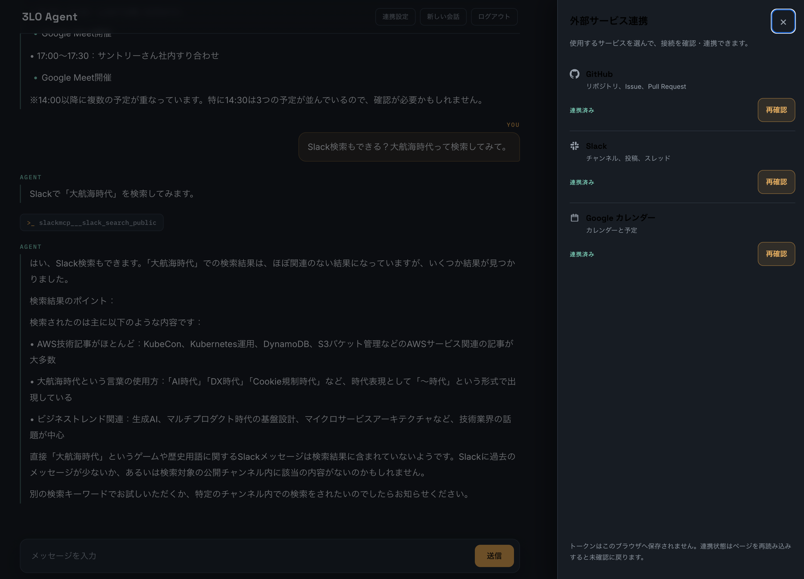

# 事前連携設定の実機確認フィードバック

## この文書について

2026-07-24 に sandbox 環境で事前連携設定を操作した結果、次の改善要望を記録します。

- 連携状態をパネル表示時に自動確認してほしい
- 3 サービスを並列確認し、直近の確定状態を短時間キャッシュしてほしい
- 連携設定パネルの文字色が背景色と合っておらず、読みづらい

これは実装済みの[事前連携設定の設計・実装計画](connection-settings-design.md)に対する追加フィードバックです。次の実装者が要件と技術的な制約を調べ直さなくてよいように、期待する挙動、推奨する実装方針、受け入れ条件までまとめます。

- 確認日: 2026-07-24
- 確認環境: Amplify sandbox / デスクトップブラウザ
- 対象: GitHub、Slack、Google カレンダーの連携設定パネル
- ステータス: 対応済み（2026-07-24）



## 要約

| ID | 優先度 | フィードバック | 期待する結果 |
|---|---|---|---|
| FB-01 | 高 | パネルを開いても、各サービスを手動で「確認・連携」「再確認」しないと現在の状態が分からない | パネルを最初に開いた時点で、3 サービスの状態確認が自動で始まる |
| FB-02 | 高 | パネルの見出しとサービス名が暗い背景に暗い文字で表示される | パネル内の主要テキストがデザイントークンどおりの明色で表示され、WCAG AA のコントラストを満たす |
| FB-03 | 高 | 3 サービスの確認が直列で待たされ、再読み込みごとに前回状態が消える | 3 サービスを並列確認し、同じタブでは直近 5 分の前回値をすぐ表示する |

## FB-01: パネル表示時に連携状態を自動確認する

### 観察した挙動

現在は、Token Vault に有効なトークンが残っていても、ページを再読み込みすると表示が `未確認` に戻ります。その後、パネルを開いて各サービスの「確認・連携」または「再確認」を押すまで、実際の連携状態は分かりません。

トークンをブラウザへ保存しない方針は正しい一方で、ユーザーが知りたいのは「ブラウザに状態を保存しているか」ではなく、「今このサービスを利用できるか」です。連携状態を見るためのパネルで、3 サービスを毎回個別に確認する操作は負担になります。

現行設計では、パネルを開いただけでは外部サービスを呼ばないことを明示的な原則にしています。このフィードバックは、その判断を変更し、ユーザー操作の少なさを優先したいという要求です。

### 期待する挙動

1. ページ読み込み後、ユーザーが連携設定パネルを初めて開く
2. `未確認` またはキャッシュ由来のサービスについて、接続状態の確認が並列で始まる
3. 各行が `確認中` から次のいずれかへ遷移する
   - `連携済み`
   - `未連携`
   - `確認できませんでした`
4. 未連携でも、OAuth 画面を自動で開かない
5. 認可の開始は、ユーザーが対象サービスの「連携する」を押したときだけ行う
6. 同じページ内でパネルを閉じて開き直しても、確認済みのサービスを毎回再確認しない
7. 明示的な「再確認」は引き続き利用できる

トークンは従来どおりブラウザへ保存しません。確定した状態と確認時刻だけをユーザー別に `sessionStorage` へ 5 分間保存します。ページを再読み込みした場合は前回値をすぐ表示し、次にパネルを開いたときに改めて自動確認します。

パネル下部の説明も、挙動に合わせて次のように変更します。

> 接続状態はこのタブに5分間キャッシュされ、パネルを開くと並列で再確認します。トークンは保存されません。

### 既存の `connection_probe` をそのまま自動実行しない

現在の `connection_probe` は、未連携の場合に認可 URL を返したあと、最大 5 分間認可完了を待ちます。また、Session Binding の PENDING レコードは `userId` 単位で 1 件しか保持できません。

そのため、パネル表示時に既存の `connection_probe` を 3 サービス分そのまま実行すると、次の問題が起きます。

- 最初の未連携サービスで最大 5 分間停止する
- 複数プローブを並列実行すると PENDING レコードが競合する
- ユーザーが連携を選んでいない段階で認可待機が始まる
- チャット送信が意図せず長時間無効になる

### 推奨する実装方針

自動確認と認可開始を別の操作に分けます。

#### 自動確認用の `connection_check`

Runtime に、認可完了を待たない確認専用操作を追加します。

```json
{
  "operation": "connection_check",
  "provider": "github"
}
```

`connection_check` は次のように動作します。

1. provider を whitelist で検証する
2. 既存の読み取り専用 probe tool を 1 回だけ呼ぶ
3. 成功なら `connected` を返す
4. 3LO elicitation なら認可 URL を画面へ返さず、`not_connected` を返して終了する
5. provider API の失敗なら `error` を返す
6. LLM、AgentCore Memory、`POST /auth/pending`、5 分間の retry loop は使わない

想定イベント:

```text
data: {"type":"connection_status","provider":"github","status":"checking"}
data: {"type":"connection_status","provider":"github","status":"connected"}
```

または:

```text
data: {"type":"connection_status","provider":"github","status":"not_connected"}
```

`not_connected` は「Token Vault に有効なトークンがなく、読み取りツールを現在利用できない」ことを示します。既存の `authorization_required` は、ユーザーが認可を開始した後の状態として残します。

#### フロントエンドの実行方法

- パネルを開いたとき、`unknown` またはキャッシュ由来の provider を対象にする
- GitHub、Slack、Google カレンダーの `connection_check` を `Promise.allSettled` で並列実行する
- 1 件が `not_connected` または `error` でも、残りの確認を続ける
- キャッシュ由来の行は前回値を残し、スピナーで再確認中であることを示す
- `not_connected` の行には「連携する」を表示する
- 「連携する」を押した後は、既存の `connection_probe` と Session Binding を使う

並列化するのは、各 `connection_check` が独立した 1 回限りの読み取りであり、PENDING や認可待機を作らないためです。認可フローの 1 ユーザー 1 件制約は、ユーザーが「連携する」を押した後の `connection_probe` にだけ適用します。

### 受け入れ条件

- [x] ページ読み込み後、パネルを最初に開くと、クリックなしで 3 サービスの確認が始まる
- [x] 3 サービスの確認は並列で開始される
- [x] 手動の「再確認」も別サービスなら並列で開始できる
- [x] 有効なトークンがあるサービスは `連携済み` になる
- [x] トークンがないサービスは `未連携` になり、「連携する」を表示する
- [x] 自動確認だけでは OAuth 画面を開かず、認可リンクも表示しない
- [x] 自動確認だけでは `POST /auth/pending` を呼ばない
- [x] 1 サービスの未連携または失敗が、残りの確認を止めない
- [x] パネルを閉じて開き直しても、同じページ内では自動確認を繰り返さない
- [x] 「再確認」で任意のサービスだけ再確認できる
- [x] パネル下部の説明が、自動確認する挙動と矛盾していない
- [x] 自動確認の結果や tool chip がチャット履歴へ追加されない
- [x] トークン、認可 URL、provider のレスポンス本文をブラウザへ保存しない
- [x] `connected` / `not_connected` と確認時刻だけをユーザー別に 5 分間キャッシュする
- [x] キャッシュ表示中もパネルを開くとバックグラウンドで再確認する
- [x] 既存のチャット起点認可と手動の事前連携が引き続き動作する
- [x] 認可完了後のコールバックタブは自動で閉じ、制限時は手動ボタンを残す

### 必要なテスト

- `connection_check` は tool を 1 回だけ呼び、retry しない
- elicitation を `not_connected` へ変換し、認可 URL を返さない
- パネル初回表示で対象 provider を待ち合わせずに並列開始する
- 1 provider が失敗してもほかの provider の完了を待つ
- パネル再表示では確認済み provider を再実行しない
- 自動確認では `/auth/pending` を呼ばない
- キャッシュをユーザー間で共有せず、5 分後に期限切れにする
- キャッシュへ認可 URL、トークン、provider レスポンスを含めない

## FB-02: 連携設定パネルの文字色を修正する

### 観察した挙動

実機スクリーンショットでは、次の主要テキストが暗いパネル背景に暗い文字で表示されています。

- 「外部サービス連携」の見出し
- GitHub、Slack、Google カレンダーのサービス名

説明文、状態、ボタンには個別の色が指定されているため読めますが、視線の起点になる見出しとサービス名が最も読みづらい状態です。背後のチャットが暗くなるのは modal backdrop の意図した挙動ですが、前面のパネルまで暗く見えるのは意図していません。

### 原因候補

`body` には `color: var(--text)` がありますが、ネイティブの `<dialog class="connection-panel">` と `.connection-panel-inner` には文字色がありません。また、見出しと `.connection-name` にも個別の `color` がありません。

ブラウザの `<dialog>` のユーザーエージェントスタイルによって `CanvasText` 相当の暗色が使われ、`body` の明るい文字色が期待どおり継承されていない可能性が高いです。

現在のデザイントークンから算出したコントラスト比は次のとおりです。

| 前景色 | 背景色 | コントラスト比 | 判定 |
|---|---|---:|---|
| `--text: #e9ecef` | `--surface: #171c23` | 14.44:1 | WCAG AA を十分満たす |
| `--text-dim: #98a2ad` | `--surface: #171c23` | 6.61:1 | 通常テキストでも WCAG AA を満たす |
| 黒 `#000000` | `--surface: #171c23` | 1.23:1 | 不合格 |

### 推奨する修正

パネルのルートで文字色を明示し、内部要素の既定色をデザイントークンへ揃えます。

```css
.connection-panel {
  color: var(--text);
}
```

ブラウザ差をより局所的に避ける場合は、`.connection-panel-inner` にも `color: var(--text)` を指定します。サービス名と見出しへ個別指定を重ねるより、パネル全体の既定色を 1 か所で定義する方が保守しやすくなります。

`--text-dim`、`--mint`、`--accent-strong`、`--danger` を使っている説明文、状態、操作、エラーは、その役割に応じた既存色を維持します。

### 受け入れ条件

- [x] 見出しと 3 サービス名の computed color が `--text` と一致する
- [x] パネル内の通常サイズの文字が背景に対して 4.5:1 以上のコントラストを持つ
- [x] 状態を色だけでなく、従来どおり文字でも判別できる
- [x] hover、focus、disabled、error の各状態でも文字を読める
- [x] modal backdrop は背後のチャットだけを暗くし、前面パネルのコントラストを下げない
- [ ] デスクトップとモバイル幅の両方で確認する
- [ ] OS のライト・ダーク設定やブラウザ既定の `<dialog>` スタイルに左右されない

### 必要なテスト

- ブラウザ上で見出しと `.connection-name` の computed style を確認する
- axe などで color contrast 違反がないことを確認する
- 通常、確認中、未連携、連携済み、error のスクリーンショットを比較する
- キーボード focus ring と文字が同時に識別できることを確認する

## 実装対象の目安

| フィードバック | 主な対象 |
|---|---|
| FB-01 | `src/components/ConnectionPanel.tsx`、`src/hooks/useConnectionManager.ts`、`src/hooks/connectionState.ts`、`src/types/runtime.ts`、`agent/main.py`、`agent/connections.py` |
| FB-02 | `src/index.css` |

FB-02 は独立した小さな修正として先に対応できます。FB-01 は Runtime event 契約と状態遷移を変更するため、設計、Agent、フロントエンド、テストを同じ変更単位で更新します。
